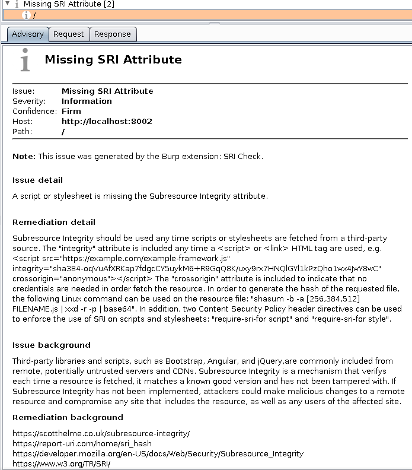

# SRI Check

A Burp Suite extension for identifying missing Subresource Integrity attributes.

* Passive scanner checks create informational issues in Burp Suite
* Only flags resources from 3rd party domains that do not include the integrity attribute.
* Written in Python
* Requires Jython 2.7+
* Pull requests welcome!

### Todo

* ~~Add support for relative paths~~
* ~~Improve regex, especially accounting for the case of script and link tags and spaces in tags~~
* ~~Check MIME type of pages to prevent running against images, CSS, etc.~~
* ~~Fix possible concurrency issues~~
* ~~Account for possible false positives on <link> tags~~

### Screenshots

